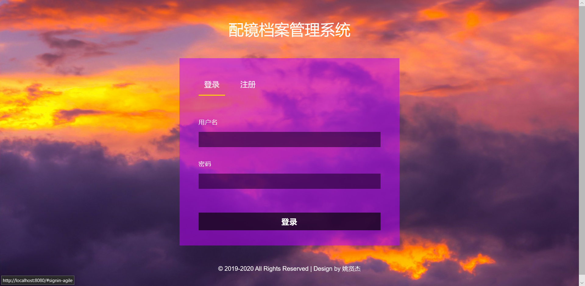
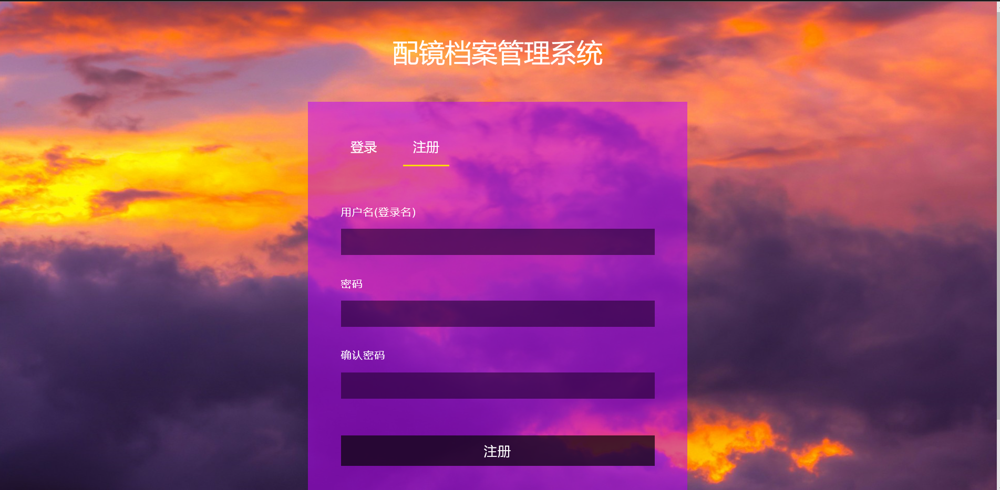
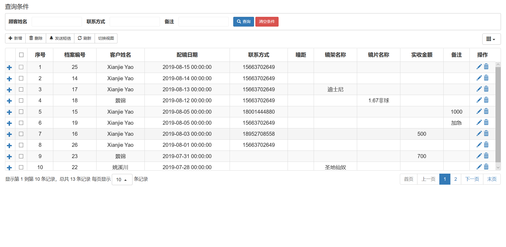
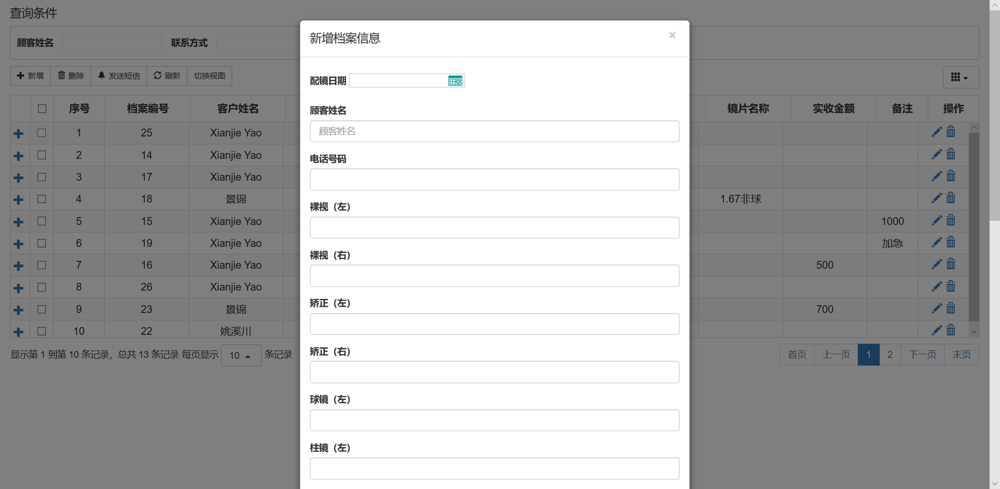

# SSM

## 简介

项目采用Spring+SpringMVC+Mybatis框架，前端使用jQuery+bootstrap，搭配bootstrap-table插件，数据库的部分crud操作代码使用mybatis-generator插件生成，分页功能使用pagehelper插件，短信推送功能使用第三方短信接口

（PS. 感谢我的小女友，用她的SSM项目带我快速入门，并免去505，500等等错误烦恼

## 截图

